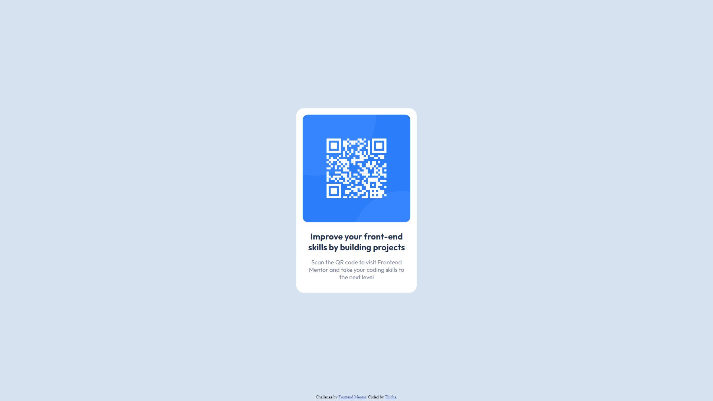

# Frontend Mentor - QR code component solution

This is a solution to the [QR code component challenge on Frontend Mentor](https://www.frontendmentor.io/challenges/qr-code-component-iux_sIO_H). Frontend Mentor challenges help you improve your coding skills by building realistic projects. 

## Table of contents

- [Overview](#overview)
  - [Screenshot](#screenshot)
  - [Links](#links)
- [My process](#my-process)
  - [Built with](#built-with)
  - [What I learned](#what-i-learned)
  - [Continued development](#continued-development)
- [Author](#author)

## Overview

### Screenshot

### Links

- Solution URL: [Github](https://github.com/thicha0/qr-code-component)
- Live Site URL: [Netlify](https://qr-code-component-thicha.netlify.app/)

## My process

### Built with

- HTML5
- CSS

### What I learned

TODO:
- Learned about all different types of measurements (rem, em, vh, vw, %, etc.)
- clamp ?

tips:
- don't use height: 100vh => min-height: 100vh + min-height: 100dvh
- box-sizing: border-box;
- landmarks

- 8-point grid: https://spec.fm/specifics/8-pt-grid => consistency of design

feedback:
- use h1 for accessibility
- flexbox: dont use margin, gap ??

## Author

- Website - [Thicha](https://thi-cha.ga/)
- Frontend Mentor - [@thicha0](https://www.frontendmentor.io/profile/thicha0)
- Github - [@thicha0](https://github.com/thicha0)
